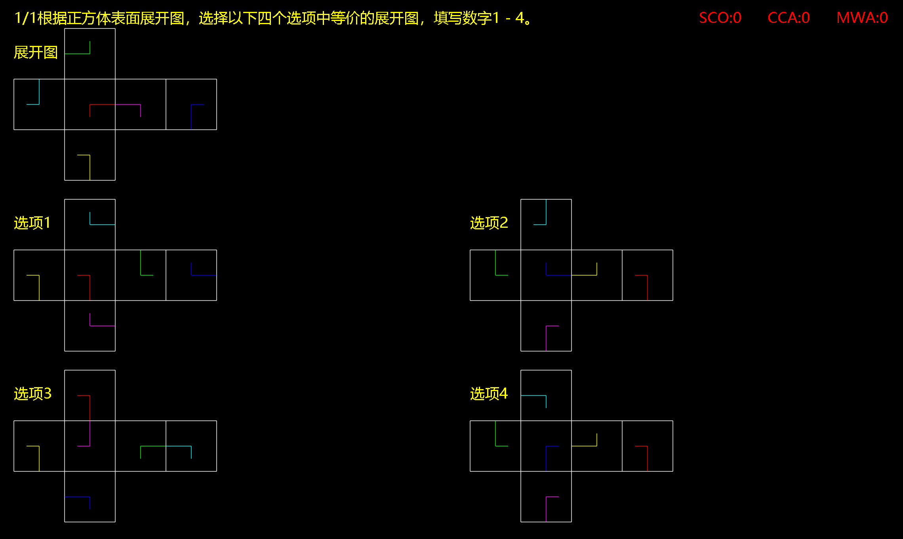

# 背景

​		公务员考试中，对于图中这类题目，女朋友总是不能很好解答，希望通过题海战术，提高解题能力。

# 简介

​		自动生成六面体，并且每面纹理随机；以其中随机五面各作为中心，生成展开图1-5，选择图1作为题设，选择2-4作为选项，并随机选择其中三项进行修改，使其不符合实际情况，确保有唯一正确答案，等待用户选择判断对错，选对则下一题，选错重新选。

​		展开图样式：其中线段表示方向，颜色确定面的唯一性

# 使用指南

​		win10 打开 Setup.msi安装

​		源码暂时未完成支持cmake工作，编译运行请使用visual Studio 2019。

